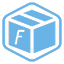

<div align="center"> <a href="https://github.com/blackstar-baba/fatherbox">  </a> <br> <br>

[](LICENSE)

<h1>FatherBox</h1>
</div>

**English** | [中文](./README.zh-CN.md) | [日本語](./README.ja-JP.md)

## Introduction

FatherBox is an open-source, free utility app built using Vben & Tauri technology. Designed to enhance user productivity, it offers a range of tools and features to streamline your workflow efficiently.

## Feature

## Preview

### Use Gitpod

Open the project in Gitpod (free online dev environment for GitHub) and start coding immediately.

[](https://gitpod.io/#https://github.com/blackstar-baba/fatherbox)

## Documentation

Sorry, no yet.

## Install and use

- Get the project code

```bash
git clone https://github.com/blackstar-baba/fatherbox.git
```

- Installation dependencies

  - Rust 1.78.0+
  - Node.js v16.13+
  - Tauri v1

- run

```bash
cargo tauri dev
```

- build

```bash
cargo tauri build
```

## Change Log

## How to contribute

You are very welcome to join！[Raise an issue](https://github.com/blackstar-baba/fatherbox/issues/new/choose) Or submit a Pull Request。

**Pull Request:**

1. Fork code!
2. Create your own branch: `git checkout -b feat/xxxx`
3. Submit your changes: `git commit -am 'feat(function): add xxxxx'`
4. Push your branch: `git push origin feat/xxxx`
5. submit`pull request`

## Git Contribution submission specification

- reference [vue](https://github.com/vuejs/vue/blob/dev/.github/COMMIT_CONVENTION.md) specification ([Angular](https://github.com/conventional-changelog/conventional-changelog/tree/master/packages/conventional-changelog-angular))

  - `feat` Add new features
  - `fix` Fix the problem/BUG
  - `style` The code style is related and does not affect the running result
  - `perf` Optimization/performance improvement
  - `refactor` Refactor
  - `revert` Undo edit
  - `test` Test related
  - `docs` Documentation/notes
  - `chore` Dependency update/scaffolding configuration modification etc.
  - `ci` Continuous integration
  - `types` Type definition file changes
  - `wip` In development

## Browser support

The `Chrome 80+` browser is recommended for local development

Support modern browsers, not IE

| [](http://godban.github.io/browsers-support-badges/)</br>IE | [](http://godban.github.io/browsers-support-badges/)</br>Edge | [](http://godban.github.io/browsers-support-badges/)</br>Firefox | [](http://godban.github.io/browsers-support-badges/)</br>Chrome | [](http://godban.github.io/browsers-support-badges/)</br>Safari |
| :-: | :-: | :-: | :-: | :-: |
| not support | last 2 versions | last 2 versions | last 2 versions | last 2 versions |

## Maintainer

[@blackstar-baba](https://github.com/blackstar-baba)

## Donate

If you think this project is helpful to you, you can help the author buy a cup of coffee to show your support!

## Contributor

## Discord

- [Github Discussions](https://github.com/blackstar-baba/fatherbox/discussions)

## License

- [MIT © blackstar-baba-2024](./LICENSE)
- This project includes code from the [vue-vben-admin](https://github.com/vbenjs/vue-vben-admin), licensed under the MIT License.
